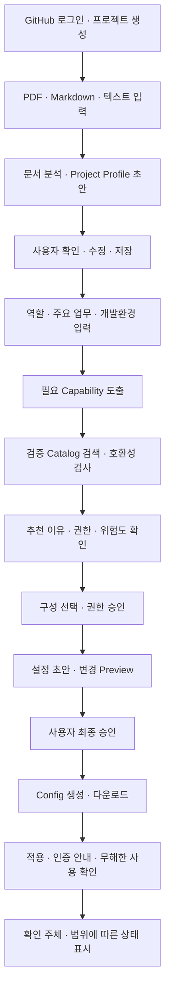

# AgentFit PRD

> 팀 공통 제품 요구사항 문서 · MVP 범위
>
> **기획서와 역할에서 출발해 개발환경을 확인하고, 프로젝트에 맞는 AI 설정을 추천·생성·적용 안내하는 웹 서비스**

## 1. 문서 목적과 적용 기준

팀 전체가 같은 제품 목표, 사용자 흐름, 기능 범위와 완료 기준을 이해하기 위한 문서다.
원래 AgentFit 기획과 확정된 요구사항을 정리하며, 개인 개발 환경이나 작업 진행률을 포함하지 않는다.
각 담당자는 [팀 설명용 기획서](project-proposal.md)로 흐름을 이해하고, 이 PRD와 [본인 파트 PRD](team-prds/README.md)·역할별 Agent.md·Feature 명세를 함께 사용한다.

요구사항의 결정 수준은 다음과 같다.

| 구분 | 이 문서에서의 의미 |
| --- | --- |
| 제품 방향·MVP 범위 | 팀이 함께 구현할 기능과 지켜야 할 원칙 |
| 첫 문서 분석 기능 | 사용자 확인을 거쳐 상세 Feature Spec에 반영된 요구사항 |
| 보완된 공통 결정 | 6.7–6.11절의 입력·권한·조합·적용 기준. 실제 검증 결과와 후속 명세 전개는 14절에서 관리 |

개발의 상세 기준은 Constitution → Feature Specification → Spec에 통합된 Clarification → Technical Plan → Tasks → 코드 순이다.
PRD는 제품 전체를 연결하는 문서이며 상세 명세를 임의로 덮어쓰지 않는다. 충돌이 발견되면 요구의 의도와 영향을 확인해 문서를 먼저 정합화한다.
패키지 버전·API 경로·DB schema·구현 파일은 Technical Plan과 계약 문서에서 관리한다.

## 2. 문제와 제품 목표

### 2.1 해결하려는 문제

AI 개발 도구에 MCP, Skill, Hook, Plugin, Project Rules 등 다양한 확장이 있지만 개발 초보자는 다음을 판단하기 어렵다.

- 내 프로젝트와 역할에 어떤 기능이 필요한가?
- 도구마다 무엇이 다르고 어떤 조합을 선택해야 하는가?
- 내가 쓰는 OS와 AI 개발 도구에서 사용할 수 있는가?
- 어떤 권한과 인증이 필요하며 어디까지 허용해야 하는가?
- 설정으로 어떤 파일이 바뀌며 기존 프로젝트에 어떤 영향을 주는가?
- 파일이 생성된 것과 실제로 연결·동작하는 것은 어떻게 구분하는가?

AgentFit은 프로젝트·사람·환경을 함께 이해해 필요한 능력을 도출하고 검증된 도구와 설정으로 연결한다.

### 2.2 제품 목표

1. 기획서를 수정 가능한 구조화된 Project Profile로 변환한다.
2. 사용자의 역할·업무·환경에 필요한 Capability를 도출한다.
3. 검증된 Catalog와 호환성 검사를 바탕으로 추천 이유와 요구 권한을 설명한다.
4. 사용자가 구성·권한·변경 내용을 확인하고 승인한 설정을 내려받아 지원 조건에 맞게 적용·확인할 수 있도록 안내한다.
5. 추천·생성·설치·연결·검증 상태를 실제 근거에 따라 보여준다.

MVP 성공은 다음 흐름이 실제로 이어지는 것이다.

**기획서 → 프로젝트 이해 → 역할·환경 확인 → Capability → 필요한 최소 구성 또는 추가 불필요 판단 → 권한 확인 → 설정 Preview → 최종 승인 → Config 다운로드·적용 안내**

### 2.3 대상 사용자

| 사용자 상황 | 필요한 가치 |
| --- | --- |
| AI 개발 확장의 차이와 설치 방법에 익숙하지 않은 개발 초보자 | 전문 용어를 먼저 공부하지 않고 필요한 구성과 이유를 이해 |
| 프로젝트에서 Frontend·Backend·Full Stack·AI·Designer 역할을 맡은 사람 | 동일 프로젝트에서도 자신의 업무에 맞는 구성 선택 |
| 사용하는 기술·OS·AI Client가 정해진 사람 | 현재 환경에서 사용할 수 있는 도구와 인증·권한 조건 확인 |

첫 기능의 데이터 접근 단위는 개인 소유 프로젝트다. 같은 팀에서 개발한다는 이유로 서비스에 팀 공유·협업 기능을 자동 포함하지 않는다.

## 3. MVP 범위

5인 팀이 한 학기 동안 사용 가능한 흐름을 단계별로 완성한다.

| 범위 | 포함 내용 |
| --- | --- |
| MVP 필수 | 로그인·개인 프로젝트, 문서 입력·분석·수정·저장, 역할·환경 입력, Capability, 검증 Catalog, 추천, 권한 설정, Config 생성, 변경 Preview, 최종 승인, 다운로드·적용·인증·확인 안내 |
| 선택 확장 | 사용자가 직접 선택한 브라우저 폴더의 파일 읽기·설정 적용 |
| 후속 확장 | Local CLI, 승인 명령 실행, 설정 백업·복원·환경 검사, 추가 AI Client Adapter |
| 첫 기능 제외 | OCR, 이미지·표의 시각적 해석, 여러 문서 병합 분석, 팀 관리·공유, 전체 Profile 이력 비교·복구 UI |
| MVP 필수로 두지 않음 | Shell 자동 실행, 모든 AI Client 지원, 인터넷 전체 도구의 실시간 검색·자동 설치 |

초기 Client는 **Codex 중심**으로 검증한다. AGENTS.md·Skill·MCP와 설정·Plugin·Hook의 실제 지원 범위는 Codex의 공식 자료와 버전별 동작을 확인해 후속 Feature에서 확정한다.
Claude Code·Cursor·VS Code Agent 등은 이후 지원 후보이며, AgentFit 개발에 사용한 도구가 제품의 검증 완료를 뜻하지 않는다.

문서 분석의 1차 평가 모델은 **Upstage Solar Pro 4**다. 이는 운영 Provider 확정이 아니며 [Provider 평가 계획](../specs/ai-developer/provider-evaluation.md)의 사전 정답·계약·실제 흐름 검증을 거쳐 결정한다. 첫 Feature의 기존 OpenAI Responses 기술 계획은 평가 결과에 따라 구현 전에 정합화한다.
정확한 OS·Client 버전·생성 형식은 후속 Feature의 지원 범위로 명시한다.

프로젝트 전용 Skill 생성은 원래 기획의 기능 후보다. Project·Developer Profile을 바탕으로 작업 전 확인·작업 규칙·작업 후 검증을 담을 수 있으며 구체적인 생성 범위는 Config Feature에서 확정한다.

## 4. 전체 사용자 흐름

- 문서에 없는 정보는 사용자가 수정하거나 추가 질문에 답할 수 있다. 미정인 채로 남기는 것도 허용한다.
- AI 분석 실패 시 재입력 기반 재시도와 Profile 직접 작성·수정 경로를 제공한다.
- 권한 승인과 최종 설정 승인은 별개의 사용자 선택이다.
- Preview를 만들기 위한 내부 초안과 사용자 프로젝트 변경·최종 다운로드 산출물을 구분한다.
- 다운로드 이후 실제 환경을 확인할 수 없으면 생성 완료·검증 미수행으로 표시한다.

### 설명용 사례

운동 서비스 기획서에 React·Node.js·인증·운동 기록 기능이 있고 DB·배포 정보는 없다면, 해당 사실을 Profile로 추출하고 DB·배포는 미정으로 남긴다.
사용자가 Backend 역할·API 업무·OS·AI Client를 입력하면 관련 Capability를 도출한다.
그다음 검증 Catalog와 호환성 조건을 통과한 후보만 추천하고, 사용자가 선택·권한·변경 내용을 승인하면 Config를 제공한다.
이 사례의 기술 스택이나 역할을 제품의 유일한 지원 대상으로 제한하지 않는다.

## 5. 핵심 정보 모델

아래는 제품이 이해해야 하는 정보의 의미다. DB 구조나 API schema를 확정하는 표가 아니다.

| 정보 | 내용 | 핵심 규칙 |
| --- | --- | --- |
| Project | 프로젝트 이름·소유 사용자·진행 상태 | 소유자만 접근 |
| Project Profile | 프로젝트명·유형·도메인, Frontend·Backend·AI, DB·배포, 핵심 기능·외부 연동·미확정 목록 | 문서 근거·사용자 수정·미정을 구분 |
| Developer Profile | 역할·주요 업무·개발 경험 | 역할 이름만으로 특정 Tool에 직결하지 않음 |
| Environment Profile | OS·AI Client·런타임 버전·기술 스택·기존 확장·인증 준비·확인 출처 | 판단에 필요한 정보만 단계별 확인, 미확인 항목을 검사 완료로 취급하지 않음 |
| Capability | 사용자의 업무에 필요한 개발 능력 | 입력 Profile과 도출 이유를 연결 |
| Tool Catalog | 배포 단위·구성요소·포함관계·의존성·중복·충돌, Capability·환경·인증·권한·출처·검증 | 고정 버전과 단독·조합의 실제 검증 범위를 구분 |
| Recommendation | 추천 항목·이유·호환성·필요 권한·위험도 | Catalog와 판단 근거 추적 |
| Permission | 작업 대상·권한 정책·판단·승인 | LLM 밖에서 검사 |
| Config | 대상 Client·설정 파일·변경 내용·승인·상태 | Preview·승인·산출물 일치 |
| Audit | 중요한 사건의 대상·시점·결과 | 원문·Secret을 담지 않음 |

Project Profile의 없는 값·상충하는 값은 null과 미확정 목록으로 표현한다.
배열의 null은 미정, 빈 배열은 명시적 없음이다. 사용자 확인 여부와 정보 완전성은 별개다.
초안·확인 Profile을 구분하고 미정 항목이 남아도 확인·저장이 가능해야 한다.

## 6. 기능 요구사항

PRD 식별자는 제품 수준의 요구사항을 추적하기 위한 것이다. 상세 Feature의 FR·SC 식별자를 대체하지 않는다.

### 6.1 로그인과 프로젝트 — 첫 흐름

| ID | 요구사항 | 핵심 수용 기준 |
| --- | --- | --- |
| PRD-01 | GitHub 로그인만 제공하고 사용자 식별에 필요한 권한만 요청한다. | 저장소 권한을 요청하지 않는다. 취소·실패·세션 만료를 로그인 성공으로 처리하지 않으며 로그아웃 후 보호된 작업을 차단한다. |
| PRD-02 | 로그인한 사용자가 본인 프로젝트를 생성·목록·상세에서 조회한다. | 빈 이름·공백 이름은 거부한다. 재접속 시 저장된 프로젝트를 찾을 수 있다. |
| PRD-03 | 모든 보호된 조회·입력·분석·수정·삭제에 소유권을 적용한다. | 비로그인과 타인 요청을 거부한다. 화면을 우회한 요청에도 적용하고 타인의 내용·존재 여부를 노출하지 않는다. |
| PRD-04 | 본인 프로젝트와 연결된 저장 데이터를 삭제할 수 있다. | 삭제 대상·함께 지울 데이터를 설명하고 확인·취소를 제공한다. 실패를 성공으로 표시하지 않고 늦은 분석 응답이 삭제된 데이터를 복원하지 않는다. |

### 6.2 문서 입력과 분석 — 첫 흐름

| ID | 요구사항 | 핵심 수용 기준 |
| --- | --- | --- |
| PRD-05 | PDF·Markdown 파일 또는 직접 텍스트를 입력받는다. | 요청 하나에는 입력 하나를 사용한다. 입력 형식과 제한을 제출 전에 안내한다. |
| PRD-06 | 파일·PDF·텍스트 한도를 검사한다. | 파일 10 MiB, PDF 100쪽, 추출·직접 텍스트 100,000 code points 이하. 포함 경계이며 초과분을 자동 절단하지 않는다. |
| PRD-07 | 읽을 수 없는 입력을 정상 분석과 구분한다. | 미지원·빈 내용·손상·잠금·텍스트 없음·부분 추출에 이유와 대체 입력 방법을 안내한다. 문서의 외부 링크·첨부 리소스를 자동 실행·가져오기하지 않는다. |
| PRD-08 | 외부 AI에 전달할 범위를 고지하고 사용자의 분석 시작 동작으로 요청한다. | 다른 프로젝트 데이터·Credential을 섞지 않는다. 외부 처리·보관 조건과 AgentFit의 보관 범위를 구분한다. |
| PRD-09 | 구조화된 Project Profile을 생성한다. | 5절의 항목을 포함하고 문서에 없는 값·상충하는 값·제안만 된 기술을 확정하지 않는다. |
| PRD-10 | 저장 전에 구조·값·미정 일관성과 근거를 검증한다. | 해석 불가·구조 오류를 성공으로 저장하지 않는다. 근거값·사용자 수정·미정을 구분하고 저장된 근거는 필요한 위치 정보로 제한한다. |
| PRD-11 | 분석 진행·저장된 초안·사용자 확인 완료·실패를 구분한다. | 중복 요청을 적절히 처리하고 재접속 시 저장 상태를 복원한다. 분석 성공을 환경 설치·검증 완료로 표시하지 않는다. |

정확한 입력 한도는 **10 MiB = 10,485,760 bytes**, **100쪽**, **100,000 Unicode code points**다.
텍스트 계산에 공백·줄바꿈을 포함한다. 각 한도와 정확히 같은 유효 입력은 크기 사유로 거부하지 않는다.

### 6.3 사용자 검토·저장·복구 — 첫 흐름

| ID | 요구사항 | 핵심 수용 기준 |
| --- | --- | --- |
| PRD-12 | 모든 Profile 항목을 수정하거나 미정으로 남기고 확인·저장한다. | 저장 후 값·미확정 목록·출처가 일치하며 재접속해도 사용자 수정값을 유지한다. |
| PRD-13 | 재분석·동시 저장으로 기존 확인값을 묵시적으로 덮어쓰지 않는다. | 새 분석은 검토 초안이다. 오래된 저장은 충돌을 알리고 최신 상태를 확인할 수 있게 한다. |
| PRD-14 | AI 실패 시 재시도와 직접 작성·수정을 모두 제공한다. | 기존 Profile을 보존한다. 기존 값이 없으면 미정 상태에서 작성하고 AI 성공과 구분한다. 재시도에는 입력 재제출을 안내한다. |
| PRD-15 | 생성·분석 결과·수정의 저장 실패를 명확히 표시한다. | 가능한 입력·결과·편집값을 현재 화면에 보존하고 재시도 행동을 제공한다. |

### 6.4 역할·환경·Capability·추천 — 두 번째 흐름

아래는 MVP의 제품 요구사항이다. 질문 세부 항목·분류·추천 순위·검증 방식은 해당 Feature에서 명세화한다.

| ID | 요구사항 | 핵심 수용 기준 |
| --- | --- | --- |
| PRD-16 | 역할·업무·경험과 OS·Client·런타임 버전·기술·기존 구성·인증 준비를 필요한 단계에서 수집한다. | 사용자 입력·직접 검사·미확인을 구분하고 변경이 추천에 영향을 주면 다시 확인한다. |
| PRD-17 | Project·Developer·Environment Profile에서 필요한 Capability를 먼저 도출한다. | 역할 이름을 특정 도구에 바로 연결하지 않고 Capability와 입력 근거를 추적할 수 있다. |
| PRD-18 | 약 15~20개의 팀 검증 도구로 Catalog를 시작한다. | Capability·지원 OS/Client·인증·권한·위험도·공식 URL·검증 버전·시점을 관리한다. 검증 수보다 검증 여부를 우선한다. |
| PRD-19 | Catalog 검색 후 호환성·포함관계·중복·충돌을 검사한다. | 검증된 지원 조합만 추천하고 추가 도구 불필요·정보 필요·호환 후보 없음을 구분한다. |
| PRD-20 | 추천 이유·예상 효과·호환 조건·인증·권한·위험도를 보여준다. | 초보자가 선택 이유와 필요한 준비를 이해할 수 있다. 설명은 실제 입력과 검증 결과에 근거한다. |
| PRD-21 | 서비스 사용자가 필요한 구성을 선택한다. | 추천 표시를 설치·권한 승인으로 취급하지 않는다. 선택 결과를 다음 권한·설정 단계에 일관되게 전달한다. |

### 6.5 권한·설정·Preview·다운로드 — 세 번째 흐름

| ID | 요구사항 | 핵심 수용 기준 |
| --- | --- | --- |
| PRD-22 | 권한 정책과 작업별 판단을 분리한다. | ALWAYS_ALLOW / ASK_EACH_TIME / DENY 정책과 ALLOW / ASK / DENY 판단을 구분하고 LLM 밖에서 검사한다. |
| PRD-23 | 작업·대상·허용 범위에 맞는 승인만 실행에 사용한다. | ASK는 응답 전 실행하지 않고 DENY는 차단한다. 승인되지 않은 권한을 허용으로 취급하지 않는다. |
| PRD-24 | 선택한 구성·Client·권한에 맞는 검토된 템플릿으로 Config 초안을 만든다. | Secret은 참조·인증 안내로 처리한다. 실행 명령·Hook은 고정 템플릿과 허용 인자만 사용하며 LLM의 임의 실행 코드를 활성화하지 않는다. |
| PRD-25 | 최종 산출물·실제 변경 전에 Preview를 제공한다. | 경로·내용과 확인한 기존 설정 범위의 변경 유형·Diff를 표시한다. 기존 파일 미확인 시 실제 CREATE/UPDATE 대신 신규 설정안과 미확인 범위를 표시한다. |
| PRD-26 | 충돌·취소·승인 이후 변경을 안전하게 처리한다. | 기존 파일을 묵시적으로 덮어쓰지 않는다. 취소 시 변경하지 않고 내용·대상이 바뀌면 기존 승인을 재사용하지 않는다. |
| PRD-27 | 최종 승인한 Config와 적용·인증·무해한 확인 안내를 제공한다. | 선택·권한·Preview·승인·산출물이 일치하고 기존 환경 미확인 범위·충돌 시 보존 방법을 안내한다. |
| PRD-28 | 확인 주체·범위·버전·시점에 따라 환경 상태를 표시한다. | 사용자 적용 보고·팀 조합 검사·실제 환경 검사를 구분하고 다운로드나 자기 보고만으로 verified를 표시하지 않는다. |

권한 후보에는 프로젝트 파일 읽기·쓰기, GitHub Issue·저장소 접근, Shell 실행, 외부 서비스 연결이 있다.
후보 목록이 해당 권한의 기본 허용이나 MVP의 실행 기능 포함을 뜻하지 않는다. 특히 GitHub 로그인에는 저장소 권한을 요청하지 않는다.

### 6.6 공통 보안·감사·UX

| ID | 요구사항 | 핵심 수용 기준 |
| --- | --- | --- |
| PRD-29 | LLM·외부 콘텐츠가 보안 경계를 변경하지 못하게 한다. | 문서 지시로 도구 실행·권한 변경·Secret 조회가 일어나지 않는다. |
| PRD-30 | 시스템 Credential과 입력에서 식별된 Secret을 격리한다. | AI 요청 전에 제거하거나 차단하고 사용자 오류·로그·Audit에 노출하지 않는다. |
| PRD-31 | 중요한 사건을 최소 정보로 추적한다. | 분석 시작·성공·실패·확인 저장 및 관련 Feature의 추천·권한·설정 결과를 대상·시점·결과와 연결한다. |
| PRD-32 | 정의된 데이터 보관·삭제 정책을 지킨다. | 첫 분석의 처리 종료 후 업로드 원문·추출문을 별도로 보관하지 않는다. 실패 건에서 수신한 LLM 원본 응답만 진단용으로 최대 7일 보관하고 만료·프로젝트 삭제 시 제거한다. |
| PRD-33 | 초보자가 상태와 다음 행동을 이해하도록 한다. | 주요 입력·수정·저장 흐름을 키보드로 수행하고 오류·진행·성공·실패를 색상만으로 구분하지 않는다. |

### 6.7 환경 확인과 추천 결과의 구분

| 결과 수준 | 필요한 정보 | 제공할 수 있는 결과 |
| --- | --- | --- |
| 기획 기반 제안 | 기획서·확인 Profile·역할·업무 | Capability와 후보 초안. 실제 설치·충돌·유효 권한을 확인했다고 표시하지 않음 |
| 환경 조건 확인 | OS·Client와 버전·런타임·기존 확장·인증 준비 여부 | 검증된 지원 조합에 대한 추천과 준비 조건. 사용자 입력과 직접 검사 결과의 출처를 구분 |
| 기존 설정 확인 | 사용자가 제공한 필요한 설정의 정제된 내용·대상 경로·버전 | 그 입력 범위의 변경안·Diff·충돌 판정. 미제공 사용자·조직 설정은 미확인으로 표시 |

모든 정보를 처음부터 요구하지 않는다. 추천이나 생성에 실제로 영향을 주는 항목만 단계별로 확인한다.
저장소 접근 권한을 GitHub 로그인에 추가하지 않는다. 후속 Config 단계의 기존 설정 확인은 사용자가 선택한 설정 파일·직접 입력을 통해 제공하며, 브라우저 폴더 적용은 선택 기능으로 유지한다.
설정 입력은 Secret을 제거하거나 차단한 뒤 필요한 구조만 사용한다. Credential이 포함된 원문을 LLM에 보내지 않는다.

기존 파일을 보지 못했으면 '신규 환경용 설정안 · 기존 파일 미확인'으로 표시한다. 실제 CREATE/UPDATE 또는 병합 검증 완료로 단정하지 않는다.
사용자의 '기존 파일 없음' 응답은 사용자 확인 정보이며 시스템 검증과 구분한다.
확인한 파일의 fingerprint와 선택·환경이 바뀌면 이전 Preview·승인을 무효화하고 다시 확인한다. 선택적 폴더 적용도 실행 직전 대상이 달라졌으면 중단한다.

추천은 다음 네 결과를 구분한다.

| 결과 | 조건 | 다음 행동 |
| --- | --- | --- |
| 추천 가능 | 필요한 Capability에 대해 검증된 적합 후보가 있음 | 이유·추가되는 기능·권한·준비 조건 확인 |
| 추가 도구 불필요 | 확인한 기존 Client·구성으로 필요한 Capability를 충족 | 현재 구성으로 할 수 있는 일을 안내, 설치를 강요하지 않음 |
| 정보 확인 필요 | 환경·업무·기존 구성의 중요한 정보가 부족 | 판단에 필요한 질문만 제시 |
| 호환 후보 없음 | 정보는 충분하지만 검증된 Catalog에 적합 후보가 없음 | 부족한 지원 조건 설명, 도구를 만들어 내거나 임의 설치하지 않음 |

한 번의 추천에서 필수 Capability를 충족하는 최소 구성을 기본으로 제안한다. 선택 항목은 별도로 표시한다.
추천 품질은 도구 수가 아니라 업무 적합성·불필요한 추가·설정 부담으로 평가한다.

### 6.8 권한의 실제 책임과 기본 정책

| 경계 | AgentFit의 책임 | 완료 표시 조건 |
| --- | --- | --- |
| 서비스 내부 작업 | 소유권·요청·승인 검사, 분석·저장·설정 생성 제어 | 서비스의 해당 요청과 상태가 검증됨 |
| Client용 정책 생성 | 의미적 권한을 지원 Client의 구체적인 규칙으로 변환 | 검증한 OS·Client 버전·도구 조합과 변환 범위가 일치 |
| 외부 실행·인증 | 실행 Client·외부 서비스·OS가 실제 권한을 집행 | AgentFit이 관찰할 수 없는 결과는 미확인, 사용자 보고는 별도 출처 |

권한별로 대상·작업, 요청 이유, 실제 Client 규칙, 필요한 외부 인증 범위, 지원 여부, 검증 환경·사례를 기록한다.
정책을 표현하거나 확인할 수 없는 경우에는 해당 구성을 승인·실행 가능한 것으로 제공하지 않는다.
프로젝트 설정 파일 하나만으로 상위 정책·다른 도구·외부 명령의 모든 경로를 통제한다고 설명하지 않는다.

외부 연결·파일 변경·실행 가능한 구성은 사용자가 선택하기 전에는 비활성이다.
선택 후 지원하는 작업 정책의 기본값은 ASK_EACH_TIME이며, ALWAYS_ALLOW는 변환·집행 범위를 검증한 항목에 한해 사용자가 명시적으로 선택한다.
DENY는 해당 AgentFit 작업을 차단하고 해당 작업을 필요로 하는 구성은 제외하거나 명확하게 비활성 상태로 표시한다. ASK를 허용으로 바꾸지 않는다.
인증·소유권과 일상적인 프로젝트 화면 동작의 승인 의미는 해당 기능의 사용자 행동을 따르며 불필요한 중복 확인창을 추가하지 않는다.

### 6.9 Catalog와 실행 가능한 구성의 검증

Catalog 항목은 '배포 단위'와 '포함 구성요소'를 구분한다. Plugin은 Skill·Hook·MCP 등을 포함할 수 있으므로 포함관계·의존성·중복·충돌을 기록한다.
초기 약 15~20개 항목 목표는 유지하되 Plugin과 그 안의 동일 구성요소를 독립된 검증 도구 수로 중복 집계하지 않는다.

검증 기록에는 공식 출처, 고정 버전 또는 변경을 식별할 수 있는 값, 구성요소, 지원 OS·Client·런타임, 인증·권한, 단독·조합 검사 결과, 검증 시점·담당자를 포함한다.
'문서 확인', '형식 검사', '실제 동작 확인', '조합 확인'을 구분하고 실제 확인한 범위를 표시한다.
출시 시 지원표에 버전과 검사 결과가 채워진 조합만 확정 추천·생성 대상으로 활성화한다. 빈 지원표나 검증 날짜만으로 호환성을 주장하지 않는다.
도구·Client·구성요소·권한이 바뀌면 영향을 받는 검증을 무효화하고 재검증한다.

MVP의 실행 명령·Hook은 팀이 검토한 고정 템플릿과 허용한 인자만 사용한다.
LLM이 기획서에서 임의 명령·실행 경로·새 Hook 코드를 만들어 활성화하게 하지 않는다.
프로젝트 전용 Skill은 규칙·체크 절차의 문서 내용부터 생성하며, 실행 가능한 구성으로 확장하려면 별도 템플릿·권한·조합 검증을 통과해야 한다.
Plugin과 독립 Hook 등 중복 가능성이 있는 조합은 충돌 검사가 통과하기 전 함께 제공하지 않는다.

### 6.10 다운로드 이후의 적용 안내와 상태

MVP는 원격 설치·전역 실행 통제를 보장하지 않는다. **승인한 설정 다운로드와 지원 조건에 맞는 적용·인증·확인 안내**까지 필수로 제공한다.
안내에는 필요한 런타임·계정, 파일을 둘 위치, 기존 파일 충돌 시 중단·보존 방법, 인증 준비, 무해한 동작 확인 절차, 실패 시 확인할 항목을 포함한다.
검증에 쓰는 예시 동작은 Secret 조회·파괴적 변경·실제 메시지 발송을 요구하지 않는다.

상태에는 결과뿐 아니라 확인 주체·범위·대상 버전·시점을 연결한다.
생성 파일의 hash와 승인 결과는 서비스가 확인할 수 있다. 팀의 환경 검증은 그 조합의 검증이며 사용자의 로컬 환경 전체에 대한 증거가 아니다.
사용자의 '적용했음' 응답은 사용자 확인으로 표시하고 자동으로 connected·verified로 승격하지 않는다.
검사할 수 없는 상태는 '확인 필요'로 남기며 재시도·준비 조건 수정·설정 다시 생성 경로를 제공한다.

### 6.11 보완 요구사항 추적

| ID | 요구사항 | 수용 기준 |
| --- | --- | --- |
| PRD-34 | 환경 정보와 결과의 확인 수준을 구분한다. | 기존 파일·상위 정책을 모르면 해당 범위를 미확인으로 표시하고 확정 Diff·유효 권한을 주장하지 않는다. |
| PRD-35 | 추가 도구 불필요·정보 부족·호환 후보 없음을 구분한다. | 기존 구성으로 충분한 평가 사례에서 불필요한 설치·권한을 요구하지 않는다. |
| PRD-36 | 권한을 실제 규칙·지원 조건에 대응시킨다. | 표현 불가·미검증 정책은 적용 가능으로 제공하지 않고 거부·취소를 실행 경로에서 지킨다. |
| PRD-37 | 포함관계와 실행 가능한 구성·조합을 검증한다. | 중복·충돌·의존성·임의 명령 생성이 통제되고 검증한 버전·범위가 표시된다. |
| PRD-38 | 적용·인증·무해한 확인 절차를 제공한다. | 지원 사례에서 사용자가 안내를 따라 수행할 수 있고 자기 보고·팀 검사·실제 환경 검사를 구분한다. |
| PRD-39 | 기존 방법 대비 사용자 결과를 비교한다. | 완료율·시간·오류·도움·불필요한 도구를 사전 기준으로 평가하고 실패 참가자를 숨기지 않는다. |
| PRD-40 | 후속 데이터의 보관 범위를 최소화한다. | 원문·기존 설정 원문은 요청 처리 후 보관하지 않고 프로젝트 삭제 시 추천·승인·생성 이력의 최소 저장 정보도 제거한다. |
| PRD-41 | 입력·환경·선택·대상 변경 후 재확인한다. | 오래된 추천·Preview·승인을 현재 조건의 것으로 재사용하지 않는다. |

## 7. 주요 화면과 상태

화면 수·URL을 고정하는 표가 아니라 반드시 제공할 사용자 경험을 정의한다.

| 화면/영역 | 핵심 내용 | 필수 상태·예외 |
| --- | --- | --- |
| 시작·로그인 | 제품 설명·GitHub 로그인·요청 권한 | 로그인 취소·실패·세션 만료·로그아웃 |
| 프로젝트 목록 | 생성·목록·다시 열기 | 로딩·빈 목록·빈 이름·저장/조회 실패 |
| 문서 입력 | PDF·Markdown·텍스트, 제한·외부 AI·보관 안내 | 잘못된 형식·크기·읽을 수 없음 |
| 분석 진행 | 진행 안내·중복 요청 처리 | 시간 초과·중단·AI/구조 오류 |
| Profile 검토 | 초안/확인 구분, 값·미정·출처·근거, 수정·저장 | 저장 실패·재분석·오래된 저장 충돌 |
| 직접 작성 | 미정 또는 기존 값에서 작성·수정 | 입력 검증·저장 실패·사용자 출처 |
| 프로젝트 삭제 | 대상·연결 데이터·확인·취소 | 삭제 중·실패·완료 |
| 역할·환경 | 역할·업무·경험·OS·Client·기술 | 미확정·누락·지원 조건 미충족 |
| 추천 | 이유·호환성·권한·위험도·구성 선택 | 후보 없음·비호환·인증 필요 |
| 권한 선택 | 정책·대상·효과·허용하지 않을 때 영향 | ASK 응답 대기·Deny |
| 변경 Preview | 경로·내용·Diff·승인·취소 | 충돌·내용 변경·승인 불일치 |
| 다운로드·상태 | 산출물·설정/인증 안내·확인된 상태 | 생성 실패·인증 필요·검증 미수행 |

## 8. 데이터·권한·실패 처리 정책

### 8.1 데이터 생명주기

| 데이터 | 처리·보관 원칙 | 삭제·노출 범위 |
| --- | --- | --- |
| 업로드 원문·추출문·근거 인용문 | 분석 처리 중 사용하고 종료 후 별도로 보관하지 않음 | 성공·실패·시간 초과·취소·비정상 종료 포함 |
| 실패 분석의 LLM 원본 응답 | 실제 수신한 응답만 오류 추적용으로 최대 7일 보관 | 원문 일부를 포함할 수 있음. 공개 API·일반 로그·Audit에서 제외하고 만료·프로젝트 삭제 시 제거 |
| Project Profile | 초안·사용자 확인 결과를 구분해 저장 | 본인만 접근, 프로젝트 삭제 시 함께 제거 |
| 최소 문서 정보·분석 시도·감사 기록 | 필요한 유형·표시 정보·상태·시점·결과만 보관 | 원문·Secret 제외, 프로젝트 삭제 시 함께 제거 |
| Credential | Backend 또는 Local Environment에서 관리 | LLM Context·일반 결과·Config 예시·로그에 노출하지 않음 |
| 후속 추천·권한·설정 관련 데이터 | 선택·대상·버전·승인 fingerprint·상태·확인 출처의 최소 정보 | 본인만 접근, 프로젝트 삭제 시 함께 제거. 입력 원문·기존 설정 원문·원문을 포함한 병합본·Diff는 요청 처리 후 서버에 보관하지 않음 |

AgentFit이 관리하는 데이터와 외부 AI 서비스의 별도 처리·보관 조건을 구분해 고지한다.
프로젝트 삭제와 사용자 계정 삭제를 같은 기능으로 취급하지 않는다.
후속 Config의 최종 생성·다시 다운로드에 원문이 필요하면 입력을 다시 제출한다. 서버의 최소 생성 이력을 기존 파일 전체의 백업·복원 기능으로 설명하지 않는다.

### 8.2 권한 경계

**LLM → 제한된 요청 → Permission Manager → 정책·대상·작업 검사 → 허용된 실행기 → 리소스**

LLM이 요청했다는 사실은 실행 권한이 아니다.
향후 Browser 적용·Local CLI도 같은 경계를 지켜야 한다.
웹 서비스가 실제로 관여하지 않는 다운로드 이후의 외부 실행까지 통제한다고 표시하지 않는다.

### 8.3 실패와 복구

| 실패 | 서비스 동작 |
| --- | --- |
| 잘못되거나 초과한 문서 | 분석 전에 거부하고 입력 변경 방법 안내 |
| 텍스트 없음·잠금·부분 추출 | 전체 분석 성공으로 표시하지 않고 다른 지원 입력 안내 |
| AI 오류·구조 오류·시간 초과 | 저장된 Profile 보존, 재입력 재시도·직접 작성/수정 제공 |
| 저장 실패 | 미저장 상태 표시, 가능한 현재 입력·결과 보존 |
| 오래된 수정·분석 응답 | 최신 저장 보호, 충돌과 다시 확인할 방법 안내 |
| 삭제 실패·삭제 후 지연 응답 | 허위 성공·데이터 복원 방지 |
| 호환 후보 없음·인증 필요 | 상태와 필요한 준비 안내, 임의 후보·연결 성공 생성 금지 |
| 권한 거부·승인 취소·설정 충돌 | 해당 작업 차단, 기존 내용 보존, 선택 가능한 다음 행동 제공 |

## 9. 품질 요구사항과 성공 지표

### 9.1 첫 문서 분석의 확정 검증 목표

아래 수치는 기존 Feature의 성공 기준이다. 현재 달성률을 의미하지 않는다.

| 기준 | 목표 | 검증 근거 |
| --- | --- | --- |
| SC-001 전체 첫 흐름 | PDF·Markdown·직접 텍스트 각각 생성 → 분석 → 확인·수정 → 저장 → 재접속 가능 | 실제 파서·저장·화면 흐름 |
| SC-002 미확정 일관성 | 없는 DB·배포는 100% 미확정, 수정 후 미확정 목록과 값 100% 일치 | 사전 정답·편집 시나리오 |
| SC-003 사실 추출 | 최소 9개 문서, 유형별 3개에서 명시된 사실의 90% 이상 정확히 추출 | AI 출력 전에 정의한 정답표, 근거 없는 값은 오답 |
| SC-004 수정 보존 | 저장된 수정값을 재접속 후 100% 유지하고 재분석·실패·오래된 저장이 자동 변경하지 않음 | 저장·동시성·재분석 검증 |
| SC-005 실패 복구 | 정의된 실패 사례의 허위 성공 0건, 각 사례에 이유·복구 행동 | AI 실패의 재시도와 직접 작성 경로 모두 검증 |
| SC-006 Secret·지시 주입 | 준비된 사례의 외부 전달·로그 노출·문서 지시 실행·권한 변경 각각 0건 | 합성 보안 사례 |
| SC-007 초보자 사용성 | 사전 기능 설명 없이 개발 초보자 5명 중 4명 이상이 진행자 개입 없이 확인·저장 완료 | 실제 참여자 관찰 |
| SC-008 응답 시간 | 지원 한도 내 대표 입력 95%가 분석 시작 후 60초 내 결과 또는 명시적 실패 안내 | 정상 외부 서비스 조건·표본·측정법을 Plan에 정의, 장애를 성공으로 집계하지 않음 |
| SC-009 접근 격리 | 비로그인·타인 프로젝트 검증에서 타인 데이터 조회·변경 성공 0건 | 서로 다른 사용자와 직접 요청 |
| SC-010 보관·삭제 | 처리 종료·비정상 종료 후 별도 업로드 원문·추출문 잔존 0건, 실패 건 진단 응답의 7일 만료·프로젝트 삭제 후 잔존 0건, 삭제 연결 데이터·지연 복원 0건 | 저장소·로그·임시 데이터·운영 환경 검증 |

### 9.2 후속 추천·설정의 완료 검증

- 입력 Profile → Capability → Catalog → 호환성 → 추천 이유가 추적 가능하다.
- Catalog 밖 도구, 지원하지 않는 OS·Client, 후보 없음이 정의된 동작으로 처리된다.
- 지원하는 AgentFit 작업·Client 정책의 ALLOW·ASK·DENY가 검증 범위의 실행 경로와 일치하고 거부를 우회하지 못한다.
- Preview·최종 승인·다운로드 내용이 일치한다.
- 설정의 유효성, 기존 파일 충돌·내용 보존, 취소와 실패가 검증된다.
- 생성·설치·인증·연결·검증 상태는 실제 증거와 일치한다.

초기 제품 가치 비교 기준은 9.4절을 따른다. 추천 품질의 세부 정답표·지원 조합과 후속 처리 시간 목표는 해당 Feature의 명세에서 구체화하며 목표와 실제 달성 결과를 구분한다.

### 9.3 검증 원칙

Mock, 실제 DB·GitHub·외부 AI 연결, 실제 사용자 평가, 운영 환경의 보관 검증을 분리한다.
실행하지 않은 검증을 통과로 표시하지 않고 결과에 맞춰 사전 정답·요구 목표를 사후 수정하지 않는다.
측정에 필요한 최소 상태·시점·결과를 사용하고 원문·Secret을 분석 이벤트에 담지 않는다.

### 9.4 보완 평가와 제품 가치 확인

첫 문서 분석에는 다음 기준을 추가한다. 기존 SC-001–010은 유지하며 60초 내 실패 안내를 분석 성공률로 계산하지 않는다.

| 기준 | 목표 |
| --- | --- |
| SC-011 의미 반례 | 부정·후보/확정·현재/미래·다른 대상·상충·문맥 제한의 6범주, 범주별 최소 2개 정답 사례에서 미확정·확정 구분과 대상 필드값이 모두 정답과 일치 |
| SC-012 정상 입력 성공률 | 정상 외부 서비스·지원 범위에서 독립 정상 문서 최소 30개(유형별 10개)의 95% 이상이 첫 요청에서 검증된 초안을 저장·표시하고 사전 필수 사실 검토를 통과. 실패·시간 초과·재시도는 첫 요청 성공으로 세지 않음 |

SC-003 정답 문서 최소 9개, SC-011 의미 사례 최소 12개, SC-012 정상 입력 최소 30개의 목적·집계는 분리한다.
공유 가능한 사례는 재사용할 수 있지만 한 지표의 통과가 다른 지표를 대신하지 않는다. 지원 거부가 정답인 문서는 정상 입력 성공률 분모에 넣지 않는다.
문서 유형·길이·PDF 페이지·필수 근거와 기대값은 실행 전에 고정한다.

제품 가치 검증은 개발 초보자 8명의 동등 과제 비교를 초기 기준으로 삼는다.
기존 방법과 AgentFit 방식에서 준비 조건·난이도·관찰 시간을 맞추고 순서를 교차한다.
최소 6/8명이 안내만으로 지원 과제의 설정 적용과 무해한 사용 확인을 완료하고, 기존 방법보다 완료율이 낮아지지 않아야 한다.
양쪽을 모두 완료한 최소 6쌍의 참여자별 소요 시간 비율 중앙값이 0.8 이하인지 확인한다. 중도 포기·시간 초과·지원 개입도 전체 결과에 남긴다.
안전하지 않은 권한 확대·승인 없는 변경은 0건이어야 한다.
이 기준은 작은 탐색 실험의 진행 판단 기준이며 시장 전체의 효과를 통계적으로 증명하는 수치는 아니다.

추천 사례에는 '기존 기능으로 충분함', '기존 구성과 중복', '권한 거부', '지원 안 됨', '정보 부족'을 반드시 포함한다.
전체 실행 절차·표본·판정·담당과 미실행 표시는 [검증 실행 계획](validation-plan.md)에서 관리한다.

## 10. 단계별 제공 범위와 완료 조건

일정은 달력 날짜를 임의로 정하지 않고 단계별 완료 조건으로 관리한다.

| 단계 | 제공 범위 | 다음 단계로 넘어가는 조건 |
| --- | --- | --- |
| 1. 프로젝트·문서 분석 | 로그인, 프로젝트, 입력·추출·분석, Profile 검토·저장, 실패 복구·삭제 | 첫 흐름이 실제로 동작하고 필수 요구·Acceptance·검증이 충족됨 |
| 2. 역할·환경·추천 | Profile 수집, Capability, 검증 Catalog, 호환성, 추천 이유 | 실제 입력에 맞는 검증 후보와 이유·권한을 사용자에게 제공 |
| 3. 권한·설정·다운로드 | 정책 선택, 검증 템플릿·조합, Preview·최종 승인, 다운로드·적용 안내·확인 출처 | 승인 일치·거부·충돌·취소 처리와 지원 과제의 실제 사용 평가 |

세부 Feature 순서는 Foundation → Document Analysis → Developer/Environment Profile → Capability Analyzer → Tool Catalog → Recommendation → Permission Manager → Config Generator → Change Preview → Export/Apply → Environment Status다.
첫 단계에서 Foundation과 Document Analysis는 하나의 사용자 흐름으로 연결한다.
후속 단계의 조사·계약 초안은 준비할 수 있지만 첫 흐름보다 후속 구현을 앞세우지 않는다.
핵심 가정 검증은 기다리지 않는다. 인터뷰·공식 자료 조사·환경 반례 검토는 첫 단계와 병행하며, 코드·설치가 필요한 검증은 별도 범위를 제시하고 구현 전 승인을 받는다.

MVP 전체 완료 조건:

1. 세 단계의 필수 사용자 흐름이 실제로 연결된다.
2. 필수 요구사항과 Acceptance Scenario가 충족된다.
3. Plan과 실제 구조가 일치하고 필수 Tasks와 관련 검증이 완료된다.
4. Analyze에 치명적 불일치가 없고 Converge에 남은 필수 작업이 없다.
5. 실제 동작·Mock·미수행·선택 확장과 한계가 명확히 보고된다.
6. 지원 과제의 적용·사용 평가와 기존 방법 비교를 수행해 기능 충족과 사용자 가치 결과를 따로 보고한다. 가치 기준 미달이면 MVP 기능 완성과 가치 검증 실패를 함께 표시한다.

## 11. 팀 역할과 공통 계약

| 역할 | 주요 제품 책임 | 핵심 협업 |
| --- | --- | --- |
| Full Stack A | 인증·프로젝트·DB·API·분석 서비스 통합·배포 | AI 결과를 저장·상태에 연결, Frontend API 계약, 공통 보안·DB 통합 |
| Full Stack B | Catalog·호환성·추천 Backend·Permission·Config·이력 | AI Capability와 도구 매칭, Frontend/Designer의 권한·Preview 흐름 |
| AI Developer | 추출·Profile·근거·미확정·추가 질문·Capability·설명·품질 평가 | A와 분석 계약, B와 추천 근거, Frontend/Designer와 결과 의미 |
| Frontend Developer | 화면·상태·입력·수정·추천·권한·Preview·다운로드 구현 | 서버 계약 연결, 디자인·접근성·사용성 반영 |
| Designer | 사용자 여정·화면·문구·권한·Preview UX·사용성 검증 | Frontend 인계와 실제 제품 상태·데이터 정책 확인 |

공통 Profile의 필드 의미는 AI가 제안하고 A가 저장·API 계약에 통합하며 Frontend가 편집·표시 관점에서 확인한다.
DB migration·공통 의존성은 A가 통합하고, 해당 Feature의 Spec·Plan·Tasks는 팀에서 정한 통합 담당자가 관리한다.
실제 역할 배분은 Tasks에 기록하며 다섯 역할이 같은 Feature의 명세·schema를 따로 확정하지 않는다.

인계 시 요구사항·Task, 변경 파일, 입력/출력·오류, 검증 결과, 준비 조건, Mock·미구현 범위와 다음 담당자의 작업을 전달한다.

## 12. 기술·운영 제약

- 확정된 서비스 흐름은 Next.js → Spring Boot → FastAPI다. Spring Boot가 인증·비즈니스 규칙·최종 검증·PostgreSQL 저장을 맡고, FastAPI가 문서 추출·AI 분석·평가를 맡는다.
- PostgreSQL은 Spring Boot만 접근한다. 관계형 핵심 데이터와 제한적인 `jsonb`를 사용한다. 기존 Next.js 서버·Prisma 기반 Feature Plan은 이 결정에 따라 재작성한다.
- AI Provider와 Client별 Config Adapter 경계를 유지한다.
- 기존 스택을 먼저 확인하며 근거 없는 전면 교체를 하지 않는다.
- Kubernetes·Kafka·추가 서비스·불필요한 Vector DB·Agent Framework를 도입하지 않는다.
- 정확한 버전·호환성·환경 준비·실행 명령은 Plan·lockfile·개발 안내에서 검증·관리한다. 이 PRD는 설치 검증 결과가 아니다.
- 실제 외부 인증·AI·DB·운영 환경이 필요한 검증을 로컬 Mock으로 대체 완료 처리하지 않는다.

## 13. 개발·변경 관리

기본 흐름은 Spec Kit의 constitution → specify → clarify → checklist → plan → tasks → analyze → implement → 검증 → converge다.
기존 산출물이 있으면 필요한 단계부터 이어가며 없는 문서나 실패한 Skill을 실행 완료로 기록하지 않는다.

**애플리케이션 구현 전에는 해당 작업을 요청한 사용자의 명시적 승인을 받는다.**
구현 대상·작업·계약 영향·검증 방법을 제시하며 기획·디자인·문서 요청을 구현 승인으로 해석하지 않는다.
승인한 범위에서 작업을 이어가고 중요한 범위 변경만 다시 확인한다.

요구사항이 바뀌면 관련 Spec·Clarification과 Plan·Tasks 영향을 먼저 확인한다.
공통 요구가 변경되면 이 PRD와 해당 파트 PRD·역할별 Agent.md·기획서 설명도 함께 정합화한다. 개인 진행률·오류 이력은 별도 검증 기록에 남긴다.

## 14. 보완에서 정한 결정과 출시 전 증거

| 항목 | 적용할 결정 | 출시 전 확인할 증거 |
| --- | --- | --- |
| 입력 범위 | 기획 기반 제안·환경 조건 확인·기존 설정 확인을 구분 | 동일 기획·다른 기존 환경 사례의 결과 수준 |
| 추천 결과 | 추천 가능·추가 도구 불필요·정보 필요·호환 후보 없음 | 사전 정답 사례와 기존 방법 비교 |
| 지원 환경 | 검증 지원표에 채워진 조합만 활성화 | 실제 OS·Client·런타임 버전·검사 결과 |
| 권한 | 서비스 내부·Client 규칙·외부 실행의 책임을 분리 | 권한 대응표와 Allow/Ask/Deny·상위 정책 사례 |
| 실행 구성 | 검토한 템플릿·허용 인자만 사용 | Hook 명령 검토·독립 및 조합 검사 |
| 기존 설정 | 미확인 상태에서 병합·충돌 검사 완료를 주장하지 않음 | 정제된 입력·fingerprint·재확인 사례 |
| Config 이력 | 선택·버전·대상·승인 fingerprint·상태의 최소 정보 | 원문·Secret 제외와 프로젝트 삭제 연계 |
| 적용 완료 | 다운로드와 적용 안내 필수, 확인 주체를 상태에 기록 | 초보자의 실제 설정·무해한 사용 확인 |
| 문서 정확도 | 문자열 근거와 의미 판단을 분리 | SC-011 의미 반례와 SC-012 성공률 |
| 팀·운영 | 역할별 통합·재검증 담당과 지원 기록 유지 | 가용 시간·실측 재검증 시간·운영 보관 점검 |

정확한 Catalog 항목·지원 버전·Client별 파일 규격·계약 필드는 해당 Feature의 Spec·Plan에서 검증 결과를 근거로 확정한다.
이는 위 원칙을 다시 미정으로 돌리는 것이 아니다. 미검증 환경·정책·조합은 출시 대상으로 표시하지 않는다는 기본 동작은 이미 정했다.
후속 구현을 시작하기 전 해당 Feature의 명세·작업으로 전개하고 문서 간 정합성을 확인한다.

## 15. 첫 Feature와의 추적 관계

첫 문서 분석의 상세 FR·SC는 연결된 Feature Spec을 기준으로 한다.

| PRD 요구사항 | 상세 Feature 요구사항 |
| --- | --- |
| PRD-01·03 | FR-003 |
| PRD-02 | FR-001·002 |
| PRD-04 | FR-024 및 FR-021 |
| PRD-05·06·07 | FR-004·005·006·007 |
| PRD-08 | FR-008 |
| PRD-09·10 | FR-009·010·011·012 |
| PRD-11 | FR-013·022 |
| PRD-12·13 | FR-014·015 |
| PRD-14·15 | FR-016·017 |
| PRD-29·30·31·32·33 | FR-018·019·020·021·023 |
| PRD-16–28·34–41 | MVP와 보완된 공통 결정의 후속 Feature 요구사항. 상세 FR·SC·Plan·Tasks로 전개한 뒤 구현 |

참고 문서:

- [프로젝트 Constitution](../.specify/memory/constitution.md)
- [첫 문서 분석 Feature Specification](../specs/001-project-document-analysis/spec.md)
- [첫 Feature Technical Plan](../specs/001-project-document-analysis/plan.md)
- [첫 Feature Tasks](../specs/001-project-document-analysis/tasks.md)
- [역할별 Agent.md와 배포 안내](team-agents/README.md)
- [API 명세와 OpenAPI](api/README.md): 첫 Feature 계약과 후속 추천·설정 초안
- [검증 실행 계획](validation-plan.md)
- [아이디어 검증과 보완 추적](idea-validation.md)

팀원에게 **기획서·이 공통 PRD·본인 파트 PRD·Agent.md·API 명세·검증 실행 계획**을 함께 전달한다. 실제 개발은 같은 저장소의 최신 Feature Spec·Plan·Tasks·계약으로 연결한다.
