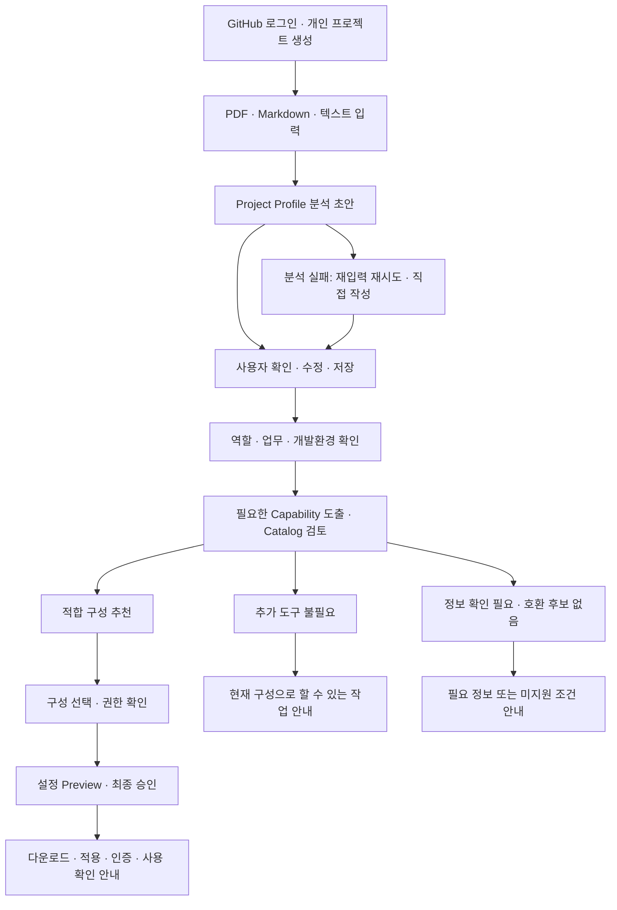

# AgentFit 프로젝트 기획서

> 팀 설명용 · 2026-09-08 · 산학협력 SW 프로젝트 · 5인 팀 / 한 학기
>
> **기획서와 역할에서 출발해 개발환경을 확인하고, 프로젝트에 맞는 AI 설정을 추천·생성·적용 안내하는 웹 서비스**

## 1. 우리가 만들 서비스

AgentFit은 개발 초보자가 자신의 프로젝트에 어떤 AI 개발 도구와 설정이 필요한지 판단하고, 실제로 사용할 준비를 하도록 돕는다.

사용자는 기획서를 넣고 분석 결과를 확인한 뒤 자신의 역할과 개발환경을 알려준다. 서비스는 필요한 작업 능력을 도출하고, 팀이 검증한 도구 중 현재 조건에 맞는 최소 구성을 제안한다. 사용자는 추천 이유·권한·바뀔 내용을 확인하고 승인한 설정과 적용 안내를 받는다.

기획서와 역할만으로 실제 PC의 기존 설정이나 권한을 알 수는 없다. 결과에 필요한 정보는 단계별로 확인하며, 확인하지 못한 부분은 결과에도 표시한다.

## 2. 어떤 문제를 해결하려는가

새 프로젝트를 시작하는 사람은 다음 질문을 한꺼번에 마주할 수 있다.

- 내 업무에 어떤 AI 기능이 필요한가?
- 도구를 추가해야 하는가, 이미 쓰는 기능으로 충분한가?
- 내 OS와 AI 개발 도구에서 쓸 수 있는가?
- 어디에 설정하고 어떤 계정·인증을 준비해야 하는가?
- 이 권한을 허용하면 무엇이 가능해지는가?
- 기존 설정을 망가뜨리지 않고 적용할 수 있는가?
- 다운로드가 끝난 것과 실제 사용 준비가 끝난 것은 어떻게 다른가?

이 어려움이 대상 사용자에게 얼마나 자주 발생하는지, 기존 방법보다 AgentFit이 얼마나 나은지는 검증할 가설이다. 인터뷰나 실제 사용 결과가 없는 상태에서 수요·시간 절감 효과를 확정하지 않는다.

## 3. 대상 사용자와 사용 시점

주 대상은 AI 개발 확장의 선택·설정에 익숙하지 않은 개발 초보자다. 프로젝트 기획이 있고, 자신의 역할과 사용할 개발환경을 정하거나 확인하는 시점에 사용한다.

| 사용자 상황 | AgentFit이 제공하려는 가치 |
| --- | --- |
| 기획서는 있지만 필요한 구성을 고르기 어렵다 | 문서를 구조화하고 역할에 필요한 작업 능력을 정리 |
| 같은 프로젝트에서 맡은 업무가 다르다 | Frontend·Backend·Full Stack·AI·Designer 등 업무 차이를 반영 |
| OS·Client·기존 설정이 있다 | 호환 조건·중복·충돌·추가 준비를 확인 |
| 추천은 받았지만 설정에서 막힌다 | 변경 내용, 인증과 적용 방법, 실패 시 다음 행동 안내 |

서비스 사용자의 역할과 AgentFit 개발팀의 다섯 파트는 별개다. 개발팀이 함께 만드는 서비스여도 첫 기능의 프로젝트는 개인 소유이며 팀 공유 기능은 포함하지 않는다.

## 4. 사용자는 무엇을 받고 끝나는가

| 단계 | 사용자가 받는 결과 |
| --- | --- |
| 문서 분석 | 수정 가능한 Project Profile, 미정 항목, 출처·근거 위치 |
| 역할·환경 확인 | 필요한 작업과 현재 조건에 대한 정리 |
| 추천 | 필요한 최소 구성, 이유·조건·권한 또는 추가 도구 불필요 판단 |
| 설정 검토 | 대상 경로·설정 내용·확인 범위에 맞는 변경안과 충돌 정보 |
| 승인·다운로드 | 승인 내용과 일치하는 설정 파일, 적용·인증·무해한 사용 확인 안내 |
| 상태 확인 | 누가 어떤 범위와 버전을 확인했는지에 따른 상태 |

다운로드 성공만으로 설치·연결·검증 완료라고 표시하지 않는다. 실제 환경을 확인할 수 없으면 그 한계를 설명한다.

## 5. 서비스 이용 흐름

추천이 항상 도구 추가로 끝날 필요는 없다. 필요한 정보를 더 묻거나 현재 구성으로 충분하다고 안내하는 것도 올바른 결과다.

### 팀 설명에 사용할 예시

가상의 운동 기록 서비스 기획서에 React·Node.js·로그인·운동 기록 기능이 있고 DB와 배포는 정해져 있지 않다고 하자.

1. AgentFit은 적힌 사실을 Project Profile로 정리하고 DB·배포는 미정으로 남긴다.
2. 사용자는 결과를 수정·저장하고 자신의 역할과 실제 업무를 입력한다.
3. Backend 담당이라면 API 규칙 확인·문서 참조처럼 업무에 필요한 능력을 검토한다. 역할 이름만으로 특정 도구를 바로 선택하지 않는다.
4. OS·AI Client·버전·기존 확장·인증 준비 중 판단에 필요한 정보를 확인한다.
5. 기존 기능으로 충분하면 추가 도구가 필요 없다고 안내한다. 추가 구성이 필요하면 검증된 후보와 이유를 제시한다.
6. 사용자가 선택·권한·설정 내용을 승인하면 파일과 적용 안내를 제공한다.

위 기술과 역할은 설명용 예시이며 유일한 지원 대상으로 제한하지 않는다. 특정 도구의 추천·호환성이 검증됐다는 예시도 아니다.

## 6. 핵심 개념을 쉽게 설명하면

| 용어 | 팀에서 사용할 의미 |
| --- | --- |
| Project Profile | 기획서에서 확인한 프로젝트 정보와 미정 항목 |
| Developer Profile | 사용자의 역할·주요 업무·개발 경험 |
| Environment Profile | OS·AI Client·런타임·기존 구성·인증 준비와 확인 출처 |
| Capability | 사용자의 업무를 수행하는 데 필요한 능력 |
| Catalog | 팀이 검증한 도구와 지원 조건을 관리하는 목록 |
| Permission | 무엇을 어디까지 허용할지 정한 정책과 작업별 판단 |
| Config / Preview | 생성할 설정과 사용자가 승인 전에 확인할 내용 |

MCP·Skill·Hook·Plugin·Project Rules는 검토할 구성 종류다. 개별 항목의 실제 기능·권한·설정 형식은 검증한 버전과 공식 근거로 확인한다.

## 7. 이번 학기에 만들 범위

| 단계 | 필수 범위 | 완료 후 보여줄 데모 |
| --- | --- | --- |
| 1. 프로젝트·문서 분석 | GitHub 로그인, 프로젝트 생성·목록·상세·삭제, 입력·추출·분석, Profile 수정·확인 저장, 실패 복구 | 실제 문서를 분석하고 수정·저장한 값이 재접속 후 유지됨 |
| 2. 역할·환경·추천 | Profile 수집, Capability, 검증 Catalog, 호환성·중복·충돌 검사, 추천 설명 | 서로 다른 업무·환경에 맞는 결과와 추가 불필요·정보 부족·후보 없음 처리 |
| 3. 권한·설정·다운로드 | 지원 권한 선택, 검증 템플릿, Preview·최종 승인, 다운로드·적용·인증·확인 안내 | 승인과 산출물 일치, 거부·취소·충돌 처리, 지원 과제의 실제 사용 평가 |

첫 흐름이 실제로 동작하고 필수 검증을 충족하기 전에 추천·Permission·Config 구현을 앞세우지 않는다. 후속 조사·수동 반례·계약 초안은 먼저 준비할 수 있다.

초기 지원 Client는 Codex 중심이며 Catalog는 팀이 검증한 약 15~20개 도구를 목표로 한다. 정확한 도구·OS·Client 버전·지원 조합은 해당 Feature에서 검증해 확정한다. 문서 분석에는 Solar Pro 4를 먼저 평가하며 운영 Provider 채택은 실제 품질 검증 후 결정한다.

브라우저에서 사용자가 고른 폴더에 적용하는 기능은 선택 확장이다. Local CLI, 모든 AI Client 지원, Shell 자동 실행과 인터넷 전체 도구의 실시간 자동 설치는 MVP 필수로 두지 않는다. OCR·이미지/표의 시각적 의미 해석·여러 문서 병합·팀 공유는 첫 기능에서 제외한다.

## 8. 다섯 파트가 어떻게 연결되는가

| 파트 | 책임질 사용자 결과 | 첫 단계에서 준비할 산출물 |
| --- | --- | --- |
| Full Stack A | 본인 프로젝트의 인증·저장·복구·삭제가 일관되게 동작 | 프로젝트/분석/Profile 계약, 저장·동시성·보관 기준, 실행 준비 조건 |
| Full Stack B | 필요한 검증 도구와 승인 범위에 맞는 설정을 제공 | 현재 기능의 보안·경계 검토, Catalog·권한 대응표 초안, 환경 반례 |
| AI Developer | 문서 사실과 미정을 구분하고 설명 가능한 결과를 제공 | Profile 의미·근거·실패 계약, 합성 정답 문서와 평가 기준 |
| Frontend Developer | 사용자가 화면에서 입력부터 확인·저장까지 수행 | 화면 상태·서버 응답 대응표, 폼·복구·접근성 흐름 |
| Designer | 초보자가 추천·권한·변경 내용과 다음 행동을 이해 | 사용자 흐름, 상태별 화면·문구, 관찰할 과제와 평가표 |

AI는 필드 의미를 제안하고 A가 공통 저장·API 계약에 통합하며 Frontend가 화면 소비를 확인한다. B는 도구·권한·설정의 판정 근거를 만들고 Designer·Frontend가 이를 사용자에게 전달한다.

동일한 계약을 파트마다 따로 만들지 않는다. 실제 Task·변경 파일의 담당은 같은 작업 목록에서 정하며, 공동 작업은 구현 담당과 검토 담당을 구분한다.

## 9. 반드시 지킬 제품 약속

- **로그인·접근:** GitHub 로그인만 제공하고 저장소 권한은 요청하지 않는다. 본인 프로젝트에만 접근한다.
- **입력 한도:** PDF·Markdown 파일 10 MiB = 10,485,760 bytes 이하, PDF 100쪽 이하, 추출·직접 텍스트 100,000 Unicode code points 이하. 공백·줄바꿈을 포함하고 초과분을 자동 절단하지 않는다.
- **분석과 저장:** 미정은 허용하며 초안과 사용자 확인 결과를 구분한다. 재분석·실패·오래된 응답이 확인값을 덮어쓰지 않는다.
- **복구·보관:** 실패 시 재입력 재시도와 직접 작성·수정을 제공한다. 관리 원문·추출문은 처리 종료 후 보관하지 않고 Profile·최소 문서 정보·분석 시도·감사 기록은 프로젝트 삭제에 연동한다. 외부 AI의 별도 보관 조건은 고지한다.
- **환경·추천:** 기획 기반 제안, 환경 조건 확인, 기존 설정 확인을 구분한다. 정보가 부족하면 실제 충돌·유효 권한을 확인했다고 표시하지 않는다.
- **권한·실행:** LLM은 권한을 결정하지 않는다. 내부 작업·생성 Client 정책·외부 실행의 책임을 구분하고 미검증 통제를 적용했다고 표시하지 않는다.
- **설정·승인:** 기존 설정 미확인 시 신규 설정안으로 표시한다. 내용·대상·환경·선택이 바뀌면 다시 Preview·승인을 받는다. Secret과 임의 실행 코드는 생성 내용에 넣지 않는다.

보완된 정책의 상세 기준은 공통 PRD 6.7–6.11절과 8절을 따른다.

## 10. 무엇을 검증하고 성공을 판단할 것인가

| 확인할 질문 | 방법 | 결과의 의미 |
| --- | --- | --- |
| 실제로 설정에 어려움을 겪는가? | 초보자 5명 이상 과거 행동 인터뷰 | 문제·진입 조건에 대한 초기 근거 |
| 기획과 환경에 맞게 판단하는가? | 기존 설정·중복·정보 부족·미지원·권한 거부 반례 | 추천·설정 판단의 적합성 |
| 문서를 올바르게 이해하는가? | FACT 9개 이상 정확도 90%, SEM 12개 이상 대상 필드 전부 정답 | 사실 추출과 문맥 의미의 품질 |
| 정상 분석이 안정적으로 끝나는가? | NORMAL 30개 이상 첫 요청 성공률 95%, 전체·성공·실패 지연 구분 | 30개라면 최소 29개 저장·표시·필수 사실 충족 |
| 초보자가 첫 흐름을 끝내는가? | 5명 중 4명 이상 진행자 개입 없이 확인·저장 | 첫 기능의 사용성 |
| 설정까지 기존 방법보다 수월한가? | 8명 동등 과제 비교, 순서 교차, 완료율·시간·도움·실패 기록 | 후속 사용자 가치의 초기 판단 |
| 유지·지원할 수 있는가? | API 비용·통합·재검증·지원 공수와 운영 보관 점검 | 한 학기 범위·운영 지속성 판단 |

문서 분석의 기존 95%·60초 결과 또는 실패 안내 목표는 유지하고 정상 성공률과 분리한다.
설정 비교는 최소 6/8명 독립 완료, 기존 방법보다 낮지 않은 완료율, 양쪽을 완료한 최소 6쌍의 개인별 시간 비율 중앙값 0.8 이하를 초기 기준으로 한다. 승인 없는 변경·안전하지 않은 권한 확대는 0건이어야 한다.
현재 수치는 검증 목표이며 달성 실적이나 시장 전체 효과의 증명이 아니다. 실제 절차·표본·판정은 검증 실행 계획에 정리한다.

## 11. 개발과 의사결정 방식

단일 웹 서비스와 DB를 중심으로 모듈을 나누는 Modular Monolith를 우선한다. 정확한 스택·버전·API·DB·파일 구조는 공통 기술 계획에서 관리한다.

기획서 → 공통 PRD → 파트별 PRD로 같은 제품을 이해한 뒤, 실제 개발은 Constitution → Feature Spec·Clarification → Plan → Tasks → 코드의 기준을 따른다.
파트별 PRD는 담당 제품 책임을 정리한 문서이며 새로운 독립 Feature나 별도 API 계약을 만들라는 뜻이 아니다.

애플리케이션 소스·설정·테스트 작성과 패키지 설치는 작업 범위를 제시하고 구현 승인을 받은 뒤 진행한다. 문서 배포는 구현 승인이나 구현 완료를 뜻하지 않는다.

달력 일정을 임의로 약속하지 않고 단계 완료 조건으로 진행한다. 팀은 착수 시 실제 담당 Task·가용 시간·공통 계약 통합 담당·외부 계정과 사용자 평가 준비를 확인한다.

## 12. 팀 회의에서 설명할 순서

1. “AgentFit은 기획서와 역할을 바탕으로 필요한 AI 개발 구성을 고르고 적용할 준비를 돕는 서비스다.”
2. 운동 기록 서비스 예시로 입력 → Profile → 업무·환경 → 추천 → 승인·설정 흐름을 설명한다.
3. 첫 데모는 프로젝트·문서 분석·수정·저장까지임을 확인한다.
4. 다섯 파트의 산출물이 어디서 연결되는지 표로 확인한다.
5. 기획·목표·실제 검증 결과를 구분하고 각 파트 PRD의 착수 산출물을 정한다.

## 함께 전달할 문서

- [공통 PRD](PRD.md): 전체 기능 요구와 보완 정책.
- [파트별 PRD와 배포 안내](team-prds/README.md): 각 파트의 책임·수용 기준·인계.
- [역할별 Agent.md](team-agents/README.md): AI 작업에 사용할 진행 지침.
- [API 명세](api/README.md): 인증·프로젝트·분석 계약과 후속 추천·권한·설정 초안.
- [검증 실행 계획](validation-plan.md): 실험 방법·담당·판정 기준.
